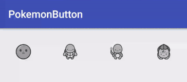

# PokemonButton

Pokemon Button (Twitter's like animation).

Inspired from [LikeButton](https://github.com/jd-alexander/LikeButton) and [LikeAnimation](https://github.com/frogermcs/LikeAnimation).

This is an example code described in blog post [PokemonButton](https://gaogggg.github.io/post/android/pokemon-button/).

## Screenshots



## Including in your project

Include the library as local library project.

```compile 'pku.edu.gg.pokemonbutton:app:0.1.0'```

## Usage

You can create your own pokemon button in xml like this (remember to add ```xmlns:wheel="http://schemas.android.com/apk/res-auto"```):

```xml
   <edu.pku.gg.pokemonbutton.PokemonButton
       android:layout_width="wrap_content"
       android:layout_height="wrap_content"
       app:icon_size="25dp"
       app:pokemon_name="pikachu"
       app:pokemon_type="electric"/>
```

Set an OnCatchListener to the button:

```Java
   pokemonButton.setOncatchListener(new OnCatchListener() {
       @Override
       public void catched(PokemonButton pokemonButton) {
                
       }

       @Override
       public void unCatched(PokemonButton pokemonButton) {

       }
   });
```

Configure using xml attributes or setters in code:

```xml
app:pokemon_name="pikachu"  //string, default is pikachu, or you can choose from pikachu, squirtle, bulbasaur, charmander
app:pokemon_type="electric"  //string, default is electric, or you can choose from electric, fire, water, grass
app:icon_size="25dp"  //button size
app:pokemon_catched_drawable="@drawable/"  //your custom catched drawable
app:pokemon_uncatched_drawable="@drawable/"  //your custom uncatched drawable
app:top_half_ball_color="@color/"  //your custom color of top-half pokeball
app:catched="false"  //boolean, pokemonbutton's status  
app:is_enabled="true"  //boolean
app:anim_scale_factor="2.5"  //float, type anim size
```

## Contribution

Please fork repository and contribute using pull requests.

There are a lot of things that need to be improved (more and better type, more pokemon, better pic and so on).

Any contributions, large or small, major features, bug fixes, additional language translations, unit/integration tests are welcomed and appreciated but will be thoroughly reviewed and discussed.

License
-------

    Copyright 2016 G

    Licensed under the Apache License, Version 2.0 (the "License");
    you may not use this file except in compliance with the License.
    You may obtain a copy of the License at

    http://www.apache.org/licenses/LICENSE-2.0

    Unless required by applicable law or agreed to in writing, software
    distributed under the License is distributed on an "AS IS" BASIS,
    WITHOUT WARRANTIES OR CONDITIONS OF ANY KIND, either express or implied.
    See the License for the specific language governing permissions and
    limitations under the License.
